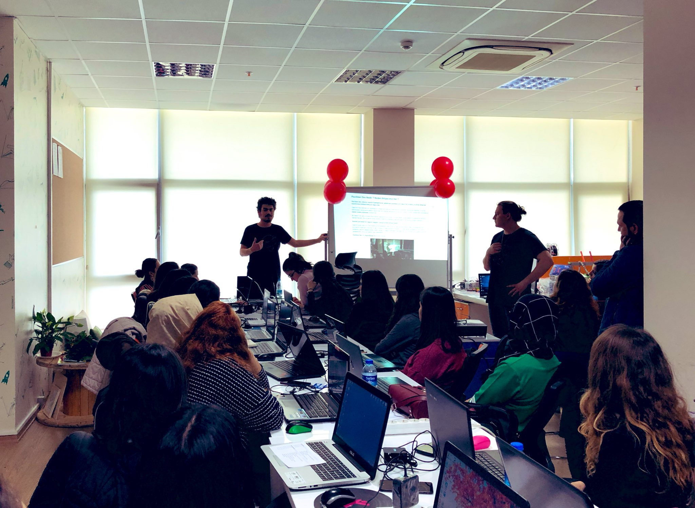
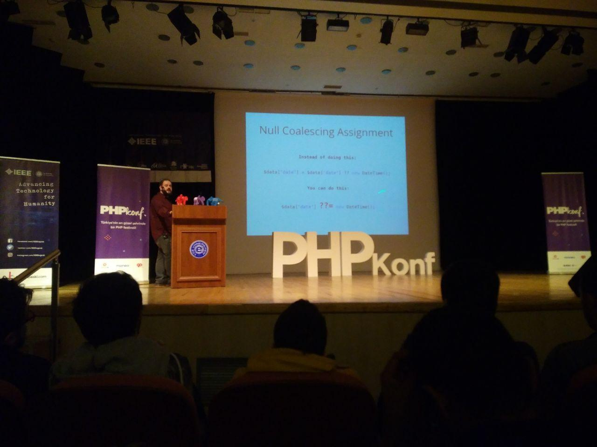
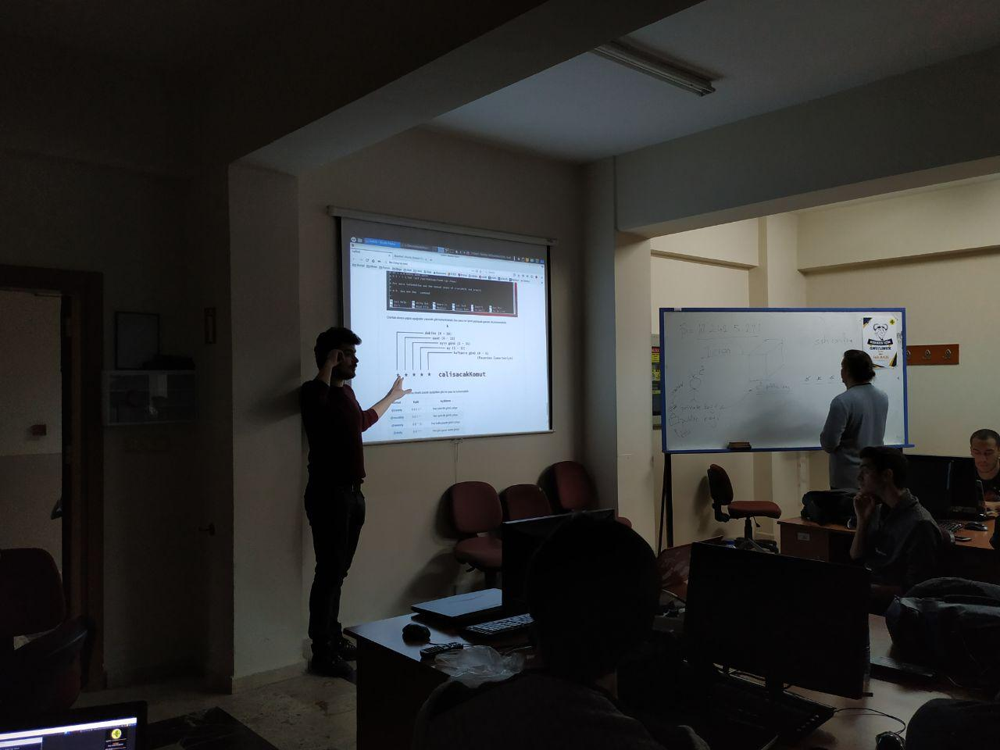
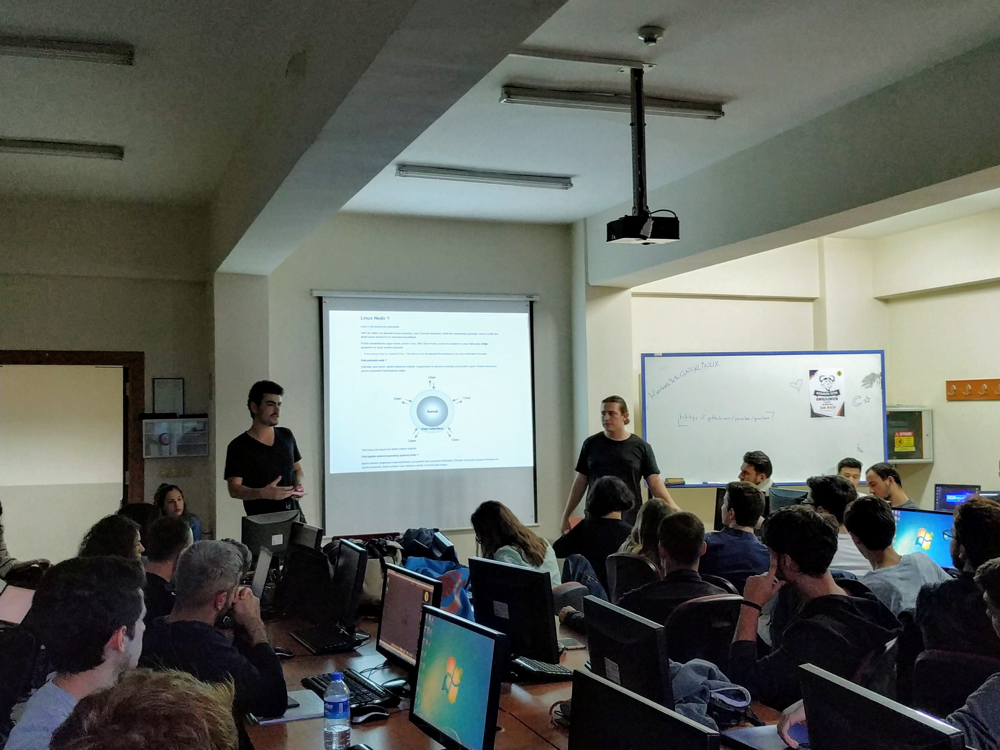
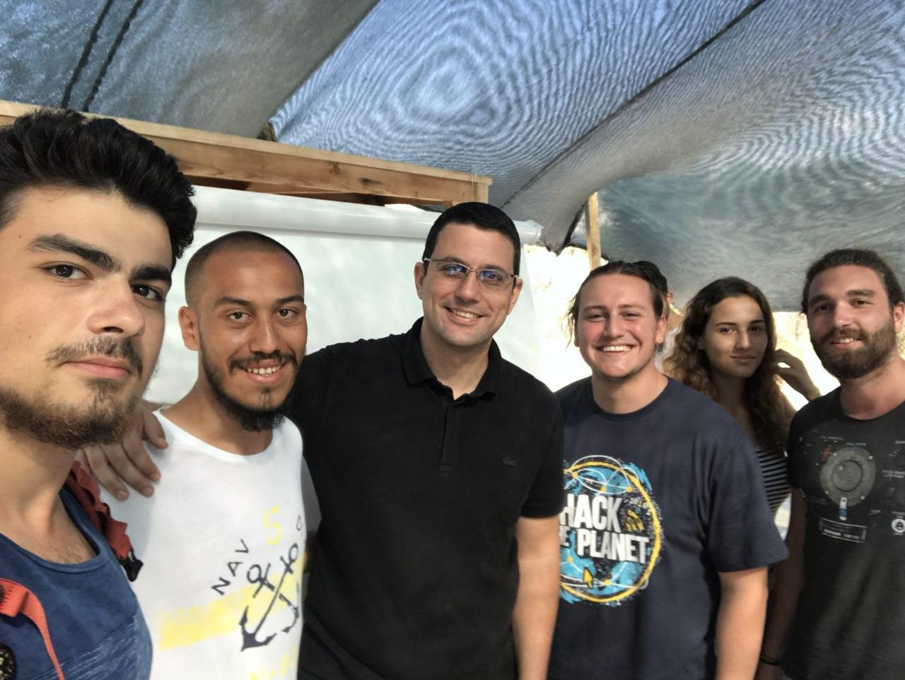
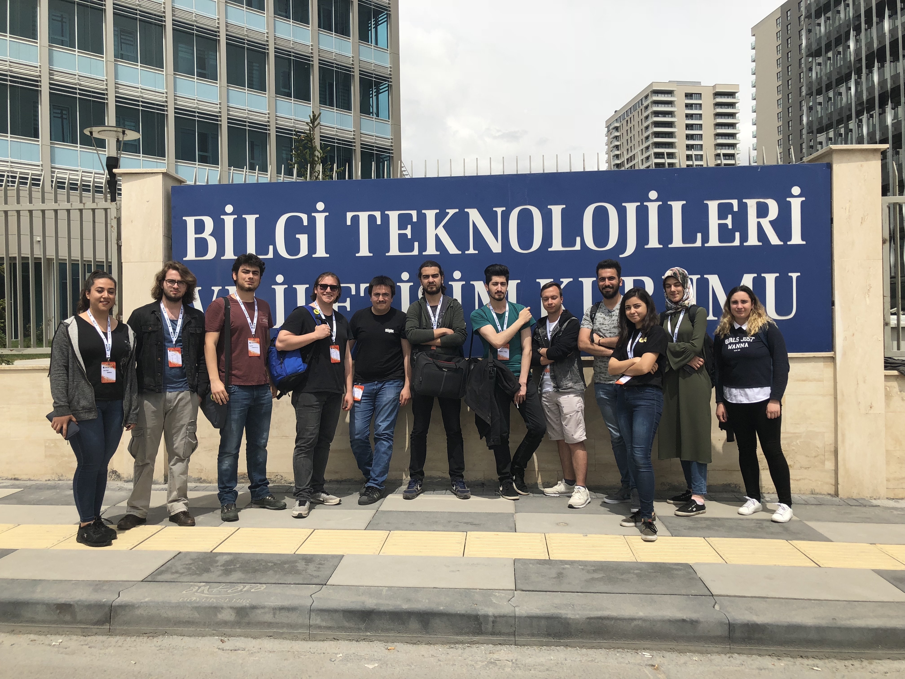
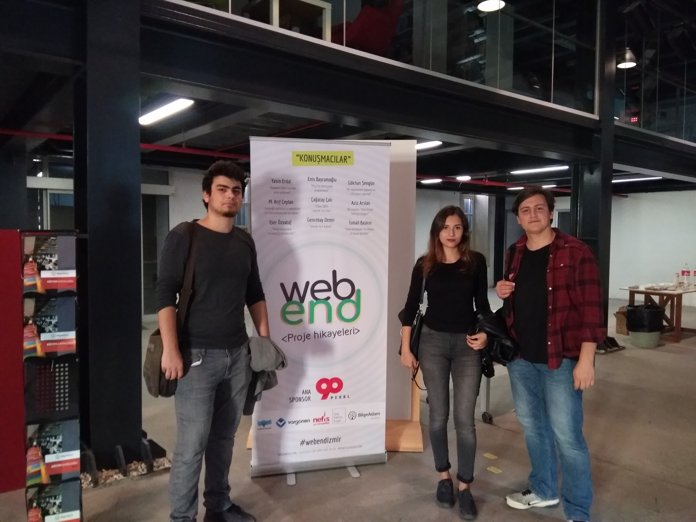

**GNU/Linux** işletim sistemleri ile tanışmam sonucunda oluşan sunucu yönetimi ve siber güvenliğe olan ilgim, meslek olarak kendime bilgisayar mühendisliğini seçmeme neden oldu. Şuan Pamukkale Üniversitesi’nde okumaktayım. Ayrıca PauSiber topluluğunun da üyesiyim.

Her ne kadar sunucu yönetiminin üzerimde bu mesleğe yönelmeme sebep verecek büyük bir kadar etkisi olsa da son zamanlarda ilgim Web alanına kaymış durumda. Bu sebep ile yaklaşık 8 aydır fikirlerime felsefi açıdan yakın hissettiğim **Ruby/Rails** üzerinde kendimi geliştirmekteyim.

Mesleki açıdan hedefim -şuanki düşüncelerime göre- kendimi **DevOps** alanında geliştirmek olsa da; geliştirme sürecinin tüm alanlarında rol alarak tecrübe etmek istememden dolayı, farklı alanlara yönelmekten çekinmemeye çalışıyorum.

---

**Maceram**, katıldığım eğitim ve konferanslar.

- Rails Girls (eğitmen olarak)

- PHPKONF

- WTK'18

- Herkes için GNU/Linux (eğitmen olarak)

- HacknBreak’18

- Özgür Yazılım Yaz Kampı’18 - GNU/Linux Sistem Yönetimi 2. Düzey

- Hacktrick’18 - Kablosuz Ağ Sızma Testleri (Besim Altınok)

- PwnlyDays’18 - Uygulamalı Ağ Güvenliği (Hakkı Yüce)

- Webend’17

